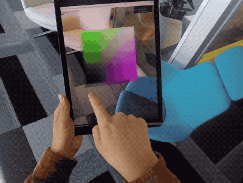

# three.ar.js

[](https://travis-ci.org/google-ar/three.ar.js)
[](https://www.npmjs.org/package/three.ar.js)
[](https://www.npmjs.org/package/three.ar.js)
[](https://www.npmjs.org/package/three.ar.js)

**A helper three.js library for building AR web experiences that run in WebARonARKit and WebARonARCore.**



[WebARonARKit] and [WebARonARCore] are experimental apps for iOS and Android that let developers create Augmented Reality (AR) experiences using web technologies. three.ar.js makes it easier to create these experiences by providing helper classes and utilities on top of the [three.js] 3D library, which interfaces with the [WebVR Extension for AR] exposed by [WebARonARKit] and [WebARonARCore]. For example:

* THREE.ARReticle: a visible reticle drawn on the real surface of real world objects.
* THREE.ARPerspectiveCamera: a camera that matches your [three.js] scene to your camera's video feed.

See [three.ar.js API documentataion](API.md) for details.

## Installing

### Script

Download the build at [dist/three.ar.js](dist/three.ar.js) and include it as a script tag in a web page. You must include [three.js] as well, and three.ar.js must be included after.

```html
<script src='three.js'></script>
<script src='three.ar.js'></script>
```

### npm

If you're using a build tool, like [browserify] or [webpack], install it via [npm]. Note you must also have [three.js] installed via npm.

```
$ npm install --save three three.ar.js
```

### CDN

```
<script href="https://cdn.jsdelivr.net/npm/three.ar.js@0.1.4/dist/three.ar.js"></script>
```

## Using

If you are including three.ar.js via script tag, the additional three.ar.js features are appended to the `THREE` namespace, for example:

```js
/**
 * Not a full working example -- see the `examples/` directory
 */
THREE.ARUtils.getARDisplay().then(init);

function init(display) {
  vrDisplay = display;
  // Set up three.js scene
  renderer = new THREE.WebGLRenderer({ alpha: true });
  scene = new THREE.Scene();

  // ...

  // Set up our ARView with ARPerspectiveCamera
  arView = new THREE.ARView(vrDisplay, renderer);
  camera = new THREE.ARPerspectiveCamera(vrDisplay, 60, window.innerWidth / window.innerHeight, vrDisplay.depthNear, vrDisplay.depthFar);
  vrControls = new THREE.VRControls(camera);

  update();
}

function update() {
  // Update our controls/camera, the ARView rendering,
  // and our three.js scene
  vrControls.update();
  arView.render();
  renderer.clearDepth();
  renderer.render(scene, camera);
  vrDisplay.requestAnimationFrame(update);
}
```

To view the additional APIs implemented by [WebARonARKit] and [WebARonARCore], view the [WebVR Extension for AR] document.

For more examples, see the [examples/](examples/) directory.

## Contributing

If you're developing and modifying the three.ar.js library itself, there are some helpful build tools for you.

### Running Development Server

Running `npm run dev` will start a local dev server from the project root at `http://0.0.0.0:8000` and rebuild and reload on changes made to `src/`. View the demos at [http://0.0.0.0:8000/examples](http://0.0.0.0:8000/examples), noting that a desktop browser won't have the AR-enhanced browser features.

If your mobile device with the AR-enhanced browser and your development machine are on the same local network, you can access these demos from your mobile device via `http://$DEV_LOCAL_IP:8000/examples`.

If the devices are not on the same network, or you're having firewall issues, you can use an [adb] command to proxy an Android device's requests to the development machine's host via `adb reverse tcp:8000 tcp:8000`.

### Building

Run `npm run build` to create a new build in `./dist`. When sending pull requests, do **not** build your changes and allow maintainers to do so.

### Linting

Run `npm run lint` to run the linter on code in `src/`.

### Testing

Right now, there are only linting tests. To run the tests, execute:

```
$ npm test
```

For testing functionality, go through the examples with your changes and ensure the expected functionality.

## Examples

Examples of three.ar.js are in the `/examples` directory. 

A [list of examples](https://developers.google.com/ar/develop/web/getting-started#examples) that are compatible with [WebARonARKit] and [WebARonARCore] is also available at [developers.google.com].

Created a cool example or want to see more from the community? Check out [this gist](https://gist.github.com/jsantell/871d7e709e5007533f3bf07c35434e29) with some links. Leave a comment to add yours!

## License
Apache License Version 2.0 (see the `LICENSE` file inside this repo).

[three.js]: https://threejs.org/
[adb]: https://developer.android.com/studio/command-line/adb.html
[npm]: https://www.npmjs.com
[browserify]: http://browserify.org/
[webpack]: https://webpack.github.io/
[WebARonARKit]: https://github.com/google-ar/WebARonARKit
[WebARonARCore]: https://github.com/google-ar/WebARonARCore
[developers.google.com]: https://developers.google.com/ar/develop/web/getting-started#examples
[WebVR Extension for AR]: webvr_ar_extension.md
